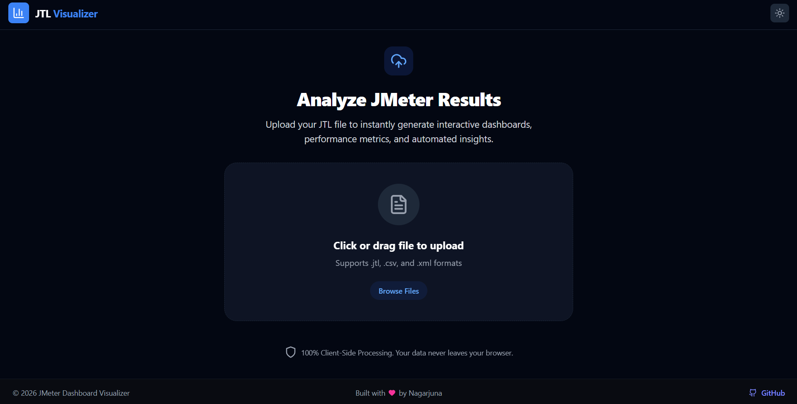

# JTL Visualizer 📊

A blazing-fast, **100% Client-Side** Progressive Web App (PWA) for analyzing and visualizing JMeter test results (`.jtl`, `.csv`, and `.xml`).



🌐 **Live Demo:** [https://nagarjunx.github.io/JTL_Visualizer/](https://nagarjunx.github.io/JTL_Visualizer/)

## 🛡️ Privacy First: 100% Client-Side Processing

Your test data is sensitive. **JTL Visualizer processes everything locally in your browser.** 
- 🚫 No data is ever sent to a backend server.
- 🚫 No cloud storage is used.
- ⚡ Parsing is handled securely on your local device using Web Workers.

## ✨ Features

- **Blazing Fast Parsing:** Uses Web Workers and `PapaParse` to handle large JMeter log files without freezing the UI.
- **Interactive Dashboards:** Visualizes Response Times, Throughput, Error Rates, Latency Comparisons, and more using `Recharts`.
- **Deep Insights:** Automatically analyzes your JTL data to provide actionable performance insights.
- **Multiple Tabs:**
  - 📈 **Overview:** High-level KPIs and charts.
  - 🎯 **Endpoints:** Detailed breakdown of performance per API endpoint.
  - ⚠️ **Errors:** Error rate charts and breakdowns.
  - 📉 **Trends:** View how performance metrics trend over the duration of the test.
  - 🔍 **Raw Data & Requests:** Inspect specific data points and request details.
- **Progressive Web App (PWA):** Install it directly to your desktop or mobile device for offline use.
- **Modern UI:** Built with React, featuring a stunning UI with seamless Dark/Light mode support via Tailwind CSS 4.

## 🛠️ Tech Stack

- **Framework:** React 19 + Vite 6
- **Styling:** Tailwind CSS 4
- **Charts:** Recharts
- **Icons:** Lucide React
- **Parsing:** PapaParse (with Streaming Web Workers)
- **Deployment:** GitHub Pages / GitHub Actions

## 🚀 Getting Started

To run this project locally:

1. **Clone the repository:**
   ```bash
   git clone https://github.com/nagarjunx/JTL_Visualizer.git
   cd JTL_Visualizer
   ```

2. **Install dependencies:**
   ```bash
   npm install
   ```

3. **Start the development server:**
   ```bash
   npm run dev
   ```

4. **Build for production:**
   ```bash
   npm run build
   ```

## 🤝 Contributing
Contributions, issues, and feature requests are welcome! Feel free to check the [issues page](https://github.com/nagarjunx/JTL_Visualizer/issues).

## 📝 License
This project is open-source.

---

Built with ❤️ by **[Nagarjuna](https://github.com/nagarjunx)**.
